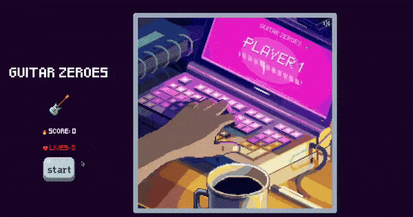

# GUITAR ZEROES

## Description

Mini game built with web technologies (html, css, javascript). This is my humble adaptation of guitar heroes. There is an easter egg hidden somewhere on the page, good luck! 🐣

## How to play

1. Click on the start butoon.
2. Wait for the music note to fall.
3. Once one music note touches an arrow keyboard, press on the designated arrow.
4. If you click on the correct key and on the right timing, you will get 1 score point.
5. If you do a 10 score streak, you will get +1 live.
6. If you reach 100 points you win the game.
7. If your lives is equal to 0, you loose the game.
8. Click on restart to try again.
9. Bonus: look for the hidden easter egg. 

## Demo

[https://sam-mou.github.io/guitar-zeroes/](https://sam-mou.github.io/guitar-zeroes/)

## Further Improvements

- add a list of songs to choose from.
- synchronize the song BPM to the music note creation.
- create a ladder of best score.